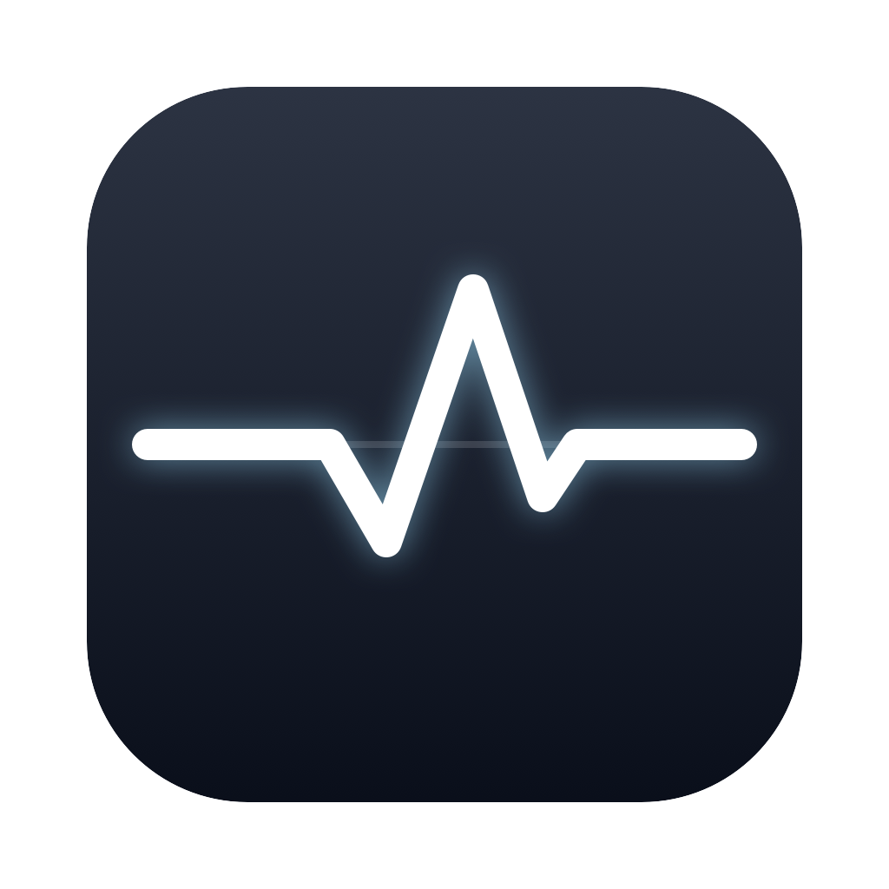

# Vitals



A tiny iStat Menus–style system monitor for the macOS menu bar. Shows CPU
temperature, CPU load, and RAM in the bar (e.g. `53° 22% 27G`); click for a
popover with sparkline history, per-metric detail, swap, network throughput,
fan RPM, and power draw.

Built with Swift + SwiftUI `MenuBarExtra`. No dependencies, no Xcode project —
just Swift Package Manager.

## How it reads the hardware

| Metric | Source |
|---|---|
| CPU load | `host_processor_info(PROCESSOR_CPU_LOAD_INFO)` tick deltas |
| CPU temperature | AppleVendor HID temperature sensors (`PMU tdie*`) via `IOHIDEventSystemClient` (private IOKit API, C shim in `Sources/SensorShims`) |
| CPU frequency | IOReport "CPU Complex Performance States" residencies weighted by the pmgr `voltage-states*-sram` frequency tables |
| Top processes | `/bin/ps` (sampled only while the popover is open) |
| RAM | `host_statistics64` (anonymous + wired + compressed pages) |
| Swap | `sysctl vm.swapusage` |
| Network | `getifaddrs` byte-counter deltas over `en*` interfaces |
| Fans / power | AppleSMC user client (`FNum`/`F*Ac`, `PSTR`) |

No sudo, entitlements, or permission prompts needed.

## Build & run

```sh
swift run Vitals                 # dev run (menu bar item, no bundle)
./scripts/bundle.sh              # release build -> dist/Vitals.app
./scripts/bundle.sh --install    # ...and install to /Applications + launch
```

Debugging the sensors without the GUI:

```sh
VITALS_DEBUG=1 swift run Vitals --sample   # dump all sensors + one snapshot
```

## Notes

- Launch at Login (toggle in the popover) requires running the bundled app,
  and macOS ties the registration to the signed binary — after rebuilding,
  re-toggle it.
- The app is ad-hoc signed; fine for personal use on this machine.
